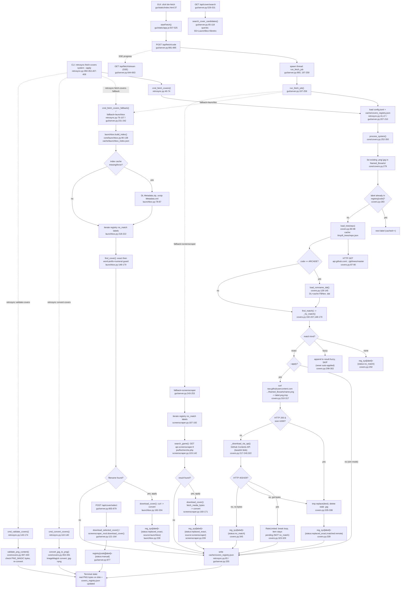

# Feature: Cover Acquisition & Repair Pipeline

Finds/downloads box-art thumbnails for ROMs from three fallback sources (libretro-thumbnails via
GitHub API, LaunchBox Games DB, ScreenScraper), then normalizes everything to real PNG bytes.

## Sources consulted

- `core/covers.py` — full file (430 lines)
- `core/launchbox.py` — full file (245 lines)
- `core/screenscraper.py` — full file (216 lines)
- `retrosync.py:1-180` (`cmd_fetch_covers` 40-74, `cmd_fetch_covers_fallback` 76-107,
  `cmd_convert_covers` 110-140, `cmd_validate_covers` 143-174) and `:340-425` (subcommands + dispatch)
- `gui/server.py:1-260` (`search_cover_candidates` 65-118, `download_selected_cover` 121-164,
  registry helpers 189-194, `run_fetch_job` 197-259), `:500-600`, `:644-663`, `:814-895`
- `gui/static/app.js:505-561` (`startFetch`, button wiring), `gui/static/index.html:37`

## Concrete findings

**CLI entry point.** `fetch-covers <system|all> [--apply]` (`retrosync.py:350-352`) dispatches to
`cmd_fetch_covers` (`:40-74`), which loads config + `cache/covers_registry.json` (`:47`), calls
`covers_mod.process_system(...)` (`core/covers.py:252-350`) per system, and writes the registry
back **after every system**, not just at the end (`:65`).

**GUI entry point.** `btn-fetch` (`index.html:37`) → `startFetch("")` (`app.js:507-556`) →
`POST /api/fetch/<code>` → server spawns `run_fetch_job` in a daemon thread, storing progress in a
`queue.Queue` under a global `_jobs` dict; `GET /api/fetch/stream` (SSE) drains that queue —
this async-job pattern is shared by every long-running GUI action (also used by heavy-roms send/download).

**Core matching (primary source).** `process_system` (`covers.py:252-350`) lists local files
already in `Named_Boxarts/` (only re-matches covers that already exist on disk with wrong/placeholder
content — it does not discover ROMs itself), skips items already in the registry, calls
`load_tree(repo)` (`:80-98`, cached, hits `api.github.com/.../git/trees/master?recursive=1` on miss).
For ARCADE, additionally resolves short romset codes via a cached FBNeo `.dat`
(`load_romname_dat`, `:128-145`; `arcade_display_name`, `:182-189` — GUI display only, never used
for file operations, per the module's own docstring: `rom_rename.py` always operates on the short
label).

`find_match` → `_try_match` (`:192-207,148-170`): exact-normalized match, then loose (strip
parens), then `difflib.get_close_matches` at cutoff 0.90 — a fuzzy hit is only accepted if
`trailing_sequence_marker` (`:66-77`) agrees between label and candidate (blocks "Dragon Quest" vs
"Dragon Quest II"). Exact/loose → kind `"exact"`; difflib path → kind `"fuzzy"`.

**Fuzzy-never-auto-applied rule.** At `:298-302`, `kind == "fuzzy"` → appended to
`result["fuzzy"]`, loop `continue`s — nothing downloaded or written, stays pending. This is the
load-bearing safety rule from the module docstring.

**Download + write (exact match, `--apply`).** `:310-348`: `curl` into `<label>.png.tmp`; on
failure, falls back to `_download_via_api` (GitHub Contents API, base64 blob, `:217-240`), which
raises `RateLimited` on HTTP 403/429. On rate-limit, the per-system loop breaks immediately —
item is **not** marked `no_match` (retried next run, distinct from genuine no-match). On success,
`tmp.replace(dest)` (atomic), deletes stale `.jpg` sibling, records `status: replaced_exact`.

**Fallback #2 — LaunchBox.** `fetch-covers-fallback` / GUI `fallback=launchbox` both call
`launchbox_mod.build_index()` (`:90-138`, cached at `cache/launchbox_index.json`; on miss downloads
+ unzips `Metadata.zip`, two `iterparse` passes). `process_system_fallback` (`:207-245`) only
iterates labels already marked `no_match` in the registry, matches via `find_cover` (exact then
word-prefix with numeral guard, `:148-179`), downloads via `download_cover` (`:182-204`: `curl` to
temp, **always** pipes through ImageMagick `convert` regardless of declared extension).

**Fallback #3 — ScreenScraper.** GUI-only (`fallback=screenscraper`, not a dedicated CLI
subcommand). `process_system_fallback` (`screenscraper.py:174-216`) scans `no_match` items, calls
`search_game` (`:103-142`, hits `api.screenscraper.fr` with dev credentials from
`config.toml [screenscraper]`, requires `dev_id`/`dev_password` else raises `NotImplementedError`),
downloads via `download_cover` (`:160-171`: fetch bytes then `convert`).

**Normalization pass (independent commands, same terminal state).** `convert-covers` →
`convert_jpg_to_png` (`covers.py:353-391`): converts stray `.jpg`/`.jpeg` via ImageMagick, or
deletes an orphan `.jpg` if a same-stem `.png` exists. `validate-covers` → `validate_png_content`
(`:397-430`): reads first 8 bytes of every `.png`, checks against `PNG_MAGIC`, re-`convert`s
in place on mismatch if `--apply`. Neither reads/writes the registry.

**GUI manual-search path.** `GET /api/cover/search` (`search_cover_candidates`, `server.py:65-118`)
queries all three sources, proxies ScreenScraper media URLs via `_ss_media_cache` id/code keys so
the credentialed URL never reaches the client (also enforced at `GET /api/cover/ss_preview`).
`POST /api/cover/select` downloads via `download_selected_cover` or
`screenscraper_mod.download_cover` directly, stamps `status: manual`.

**Registry persistence.** `cache/covers_registry.json` — single ledger keyed
`registry[system_code][label] -> {status, matched?, source?}`. Every write path reads/writes the
**entire** file (no partial/locked writes).

## Flowchart

## External dependencies

- **Shell tools** (`subprocess.run`): `curl` (all image/zip downloads), `unzip`
  (`launchbox.py:84-87`), ImageMagick `convert` (finalizes every cover as PNG —
  `covers.py:384,423`; `launchbox.py:202`; `screenscraper.py:169`; `gui/server.py:162,843`). No
  `adb.py` or `rom_rename.py` calls anywhere in this pipeline.
- **`core/covers.py:COVERS_EXCLUDED`** (`{"SDC","PS"}`) — documented as shared with `core/sync.py`
  (docstring at `:30-36` states covers.py deliberately doesn't import gui code); no verified
  import statement observed in scoped files — inferred coupling only.
- `gui/server.py` imports many other core modules (`adb_mod`, `emu_saves_mod`, `heavy_mod`,
  `memcard_mod`, `organize_mod`, `rom_rename_mod`, `sanitize_mod`, `serials_mod`) but none are
  referenced inside the fetch/cover handlers — those serve sibling GUI features.
- `covers.arcade_display_name` is explicitly documented cosmetic-only, deliberately never touching
  `rom_rename.py` (which always operates on the short label).
- `core/screenscraper.py` reads `cfg["screenscraper"]` from `config.toml`, parsed independently by
  both `retrosync.py` and `gui/server.py` (no shared config module).

## Confidence note and known gaps

High confidence on data flow and every disk/HTTP side effect — all five in-scope files read fully,
plus a targeted look at `app.js`/`index.html` for the GUI button entry point.

- `core/sync.py` not read — the `COVERS_EXCLUDED` cross-module coupling is inferred from
  docstrings only.
- `run_heavy_send_job`/`run_heavy_download_job` and other non-cover job runners only skimmed
  enough to confirm no intersection.
- `POST /api/cover/upload` (`gui/server.py:814-853`) read for context but not included as a
  primary node — shares the same convert/registry pattern, may be relevant to Cover Gallery
  Curation's "upload manual cover" flow instead.
