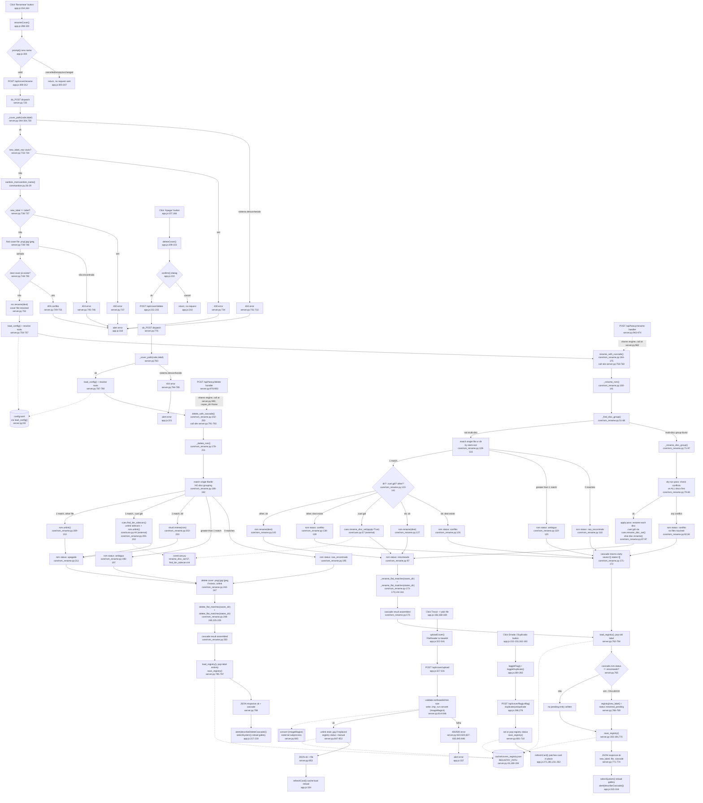

# Feature: Cover Gallery Curation

GUI-only per-cover human curation actions: flag as wrong, mark/unmark duplicate, rename
(cascading to ROM+save/state), delete (cascading), upload a manual cover image. Includes the
full trace of the shared cascade engine (`core/rom_rename.py`).

## Sources consulted

- `gui/server.py:43,58,189-194,328-393` (helpers), `:668-853` (all `/api/cover/*` POST handlers),
  `:943-993` (`/api/heavy/rename`, `/api/heavy/delete`, for shared-engine confirmation)
- `gui/static/app.js:100-341` (cover-card actions), `:417-505` inspected but excluded (manual
  search modal — belongs to Cover Acquisition Pipeline)
- `core/rom_rename.py` — full file (250 lines)
- `core/sanitize.py` — full file (59 lines)
- `core/cues.py` — signatures only (`find_bin_sidecars` L44, `rename_disc_set` L57)

## Concrete findings

**Rename flow.** "✎ Renomear" (`app.js:154,164`) → `renameCover()` (`:298-320`) → `prompt()` →
`POST /api/cover/rename`. Handler (`server.py:720-774`) resolves `_cover_path()`, sanitizes the
new name (`core/sanitize.py:26-29`, `server.py:735`), locates the current cover among
`.png/.jpg/.jpeg`, checks cover-level collision, and **renames the cover file unconditionally**
(`server.py:752`) *before* attempting the ROM cascade. Only then calls
`rom_rename_mod.rename_with_cascade()` (`core/rom_rename.py:164-175`, called at
`server.py:758-760`).

Inside the cascade, `_rename_rom()` (`rom_rename.py:100-141`) first checks
`_find_disc_group()` (`:51-68`): if `old_label` ends in `" (Disc N)"` and siblings sharing the
base title exist, the **whole group renames together** via `_rename_disc_group()` (`:71-97`,
two-pass: dry-run conflict check across all discs first, then apply) — confirming renaming
"Game (Disc 1)" cascades to Disc 2/3 as long as none conflict. `.cue/.gdi` discs go through
external `core/cues.py:rename_disc_set()`; other extensions get a plain `Path.rename()`. If no
disc group applies, single-item match yields `nao_encontrado`/`ambiguo`/`conflito`/`renomeado`.
Only on `renomeado` does the cascade rename save/state files via `_rename_flat_matches()`
(`:144-161`, called twice at `:173-174`) — exact-prefix match (`old_label + "."`, never `glob()`)
against `saves_root`/`states_root`, skipping any file whose destination already exists.

Back in `server.py:762-770`: the registry drops the old label; if the ROM cascade did **not**
succeed, a `renamed_pending` entry is written under the *new* label carrying `old_label` and
`rom_status` — the fallback letting the cover rename proceed even when the ROM side couldn't
keep up.

**Delete flow.** "🗑 Apagar" (`app.js:157,166`) → `deleteCover()` (`:209-223`) → `confirm()` →
`POST /api/cover/delete`. Handler (`server.py:776-798`) calls `delete_with_cascade()`
(`rom_rename.py:232-250`, called at `server.py:791-793`), passing the real `capas_dir` (unlike
the heavy-ROM variant). `delete_with_cascade` always attempts all four removals regardless of
partial state: `_delete_rom()` (`:178-211`, single-item match only, deletes `.bin` sidecars via
`cues_mod.find_bin_sidecars()` or `shutil.rmtree` for directories), then unlinks the cover, then
`delete_flat_matches()` for saves and states. **By design, delete never groups multi-disc
titles** (module docstring, `:35-41`) — deleting "Game (Disc 2)" removes only Disc 2. Registry
entry is unconditionally popped, no `renamed_pending`-equivalent for delete.

**Secondary paths.** Flag/unflag/duplicate/unduplicate (`server.py:681-718`) are pure registry
read-modify-write toggles, no filesystem side effects. Upload (`app.js:322-341` →
`server.py:814-853`) base64-decodes the file, writes to `.tmp`, unconditionally runs it through
ImageMagick `convert` to normalize to real PNG regardless of claimed extension (deliberate
defense per code comment `:833-840`), deletes stale sibling `.jpg`, marks `status: "manual"`.

## Flowchart

## External dependencies

- **core/cues.py** (not fully read): `rename_disc_set()` at `:57` — called from
  `rom_rename.py:81,90,131` for `.cue/.gdi` rename; `find_bin_sidecars()` at `:44` — called from
  `rom_rename.py:206` during `.cue/.gdi` delete.
- **ImageMagick `convert`** — invoked via `subprocess.run` at `gui/server.py:843`, upload path
  only, normalizes arbitrary image bytes to true PNG regardless of client-supplied extension.
- **`cache/covers_registry.json`** — touched by flag, unflag, duplicate, unduplicate, rename,
  delete, and upload.
- **`config.toml`** — via `load_config()`, supplies `roms_root`, `saves_root`, `states_root`,
  `capas_root`.
- **Heavy ROM Management — confirmed shared-engine relationship:**
  - `gui/server.py:962` — `POST /api/heavy/rename` calls the exact same `rename_with_cascade()`
    (`rom_rename.py:164-175`) that cover-rename calls at `server.py:758-760`.
  - `gui/server.py:990` — `POST /api/heavy/delete` calls the exact same `delete_with_cascade()`
    (`rom_rename.py:232-250`) that cover-delete calls at `server.py:791-793`, but with
    `capas_dir=None` (heavy systems skip the cover-deletion branch entirely).

## Confidence note and known gaps

High confidence: every node in the rename/delete cascades and registry side effects traced
directly against source, all line numbers verified.

- `core/cues.py` internals not read — treated as opaque external dependency.
- Manual-search-modal (`app.js:417-505`, `/api/cover/search`, `/api/cover/select`) inspected but
  excluded — triggered from the same card but semantically belongs to the Cover Acquisition
  Pipeline flowchart (automated match/select vs. manual upload).
- `delete_save` (`server.py:800-812`, `app.js:177-193`) read but not diagrammed in full — simple
  flat-match delete independent of registry, lower priority than the two main cascades.
