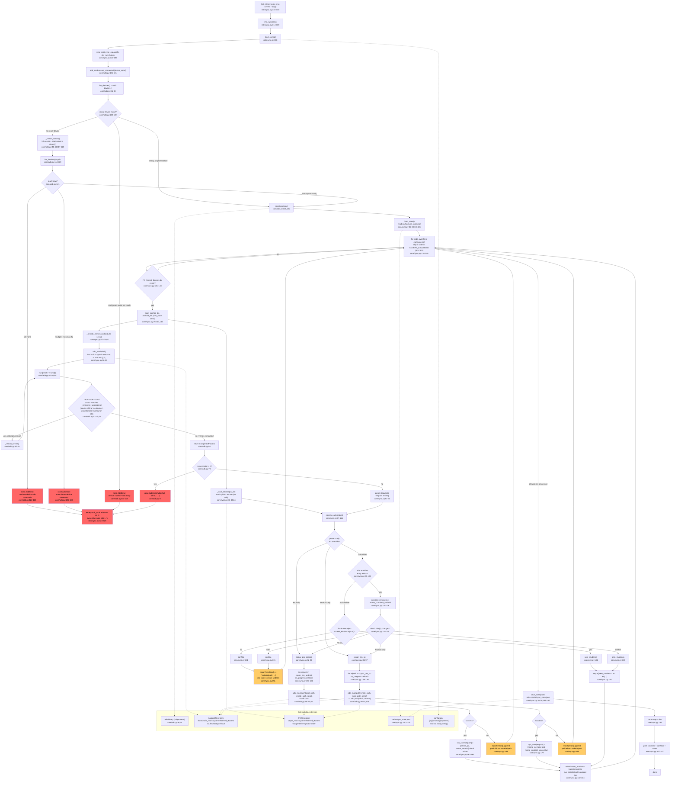

# Feature: Cover PC↔Android Sync

CLI-only two-way sync of cover art files between the PC's Google-Drive-synced
folder and the phone via adb, using a manifest file to detect conflicts.

## Sources consulted

- `core/sync.py` (189 lines, full read) — `scan_pair`, `sync_capas`, manifest handling against `cache/sync_state.json`
- `core/adb.py` (131 lines, full read) — `run`/`shell`/`push`/`pull`/`ensure_connected`, retry-on-reconnect logic
- `retrosync.py:314-348` — `sync` subcommand definition and `cmd_sync` handler

## Flowchart

## External dependencies

- **`adb` binary** (external subprocess, `core/adb.py:8,53`) — every device interaction (`devices -l`, `shell`, `push`, `pull`) shells out to the system `adb` command; `core/adb.py` is shared infrastructure also used by Heavy ROM Management and Saves/Emu-saves — not traced here beyond noting the shared dependency.
- **Android filesystem** — `<thumbnails_root>/<system>/Named_Boxarts` on the phone, read via `find ... stat` (`core/sync.py:56-59`) and written/read via `adb push`/`adb pull` (`core/adb.py:75-83`).
- **PC filesystem** — `<capas_root>/<system>/Named_Boxarts`, the Google-Drive-synced folder; read via `Path.rglob`/`os.stat` (`core/sync.py:41-44`) and written via `adb pull`'s local target.
- **`cache/sync_state.json`** — sync manifest/baseline, read by `load_state()` and written by `save_state()` (`core/sync.py:24,32-38,133,186-187`).
- **`config.toml`** (`[pc]`, `[android]`, `[systems]`) — loaded via `load_config()` in `retrosync.py:318`.

## Confidence note and known gaps

High confidence — every node traces to a specific line range in the three fully-read files.

- `retrosync.py:319-320`: `scope="all"` also routes through `sync_capas` today (saves/states/metrics not implemented, would `sys.exit` before reaching adb) — `all` and `covers` currently behave identically.
- README's "device not found" bug (README.md:173-176) is confirmed **fixed** in current code: `core/adb.py:14` includes `"not found"` in `_OFFLINE_MARKERS`, with a comment citing the same incident.
- `load_config()` internals not read in full — only call sites and config keys consumed confirmed.
- `on_progress` callback (`core/sync.py:126-127,153-155,169-170`) exists as a hook parameter but `cmd_sync` (`retrosync.py:323`) doesn't pass it — effectively a no-op on the CLI path.
