# Feature: Heavy ROM Management

On-demand (not auto-synced) transfer of large-console ROMs (PS/SDC/PS2/GameCube/Wii/PSP/3DS)
between Google Drive (via rclone), the PC, and the phone (via adb).

## Sources consulted

- `core/heavy_roms.py` — full read (219 lines)
- `core/adb.py` — full read (131 lines), call-site confirmation
- `retrosync.py:206-269` (`cmd_heavy_roms`), `:381-388` (subcommand), `:417-418` (dispatch)
- `gui/server.py:262-325` (job runners), `:560-601` (list routes), `:905-993` (action routes)
- `gui/static/app.js:567-761` (heavy-roms modal)
- `core/rom_rename.py` — signatures only, to confirm cascade call sites

## Concrete findings

Heavy systems (PS, SDC, PS2, GameCube, Wii, PSP, 3DS) come from `config.toml [heavy_systems]`
via `load_heavy_systems(cfg)` (`core/heavy_roms.py:40-41`). Unlike `[systems]` (auto-synced via
Drive), these never auto-transfer — every move is deliberate and one item at a time.

**List (PC/Drive/phone).** `list_local()` (`core/heavy_roms.py:71-87`) walks `roms_root/<CODE>/`,
summing `.bin` sidecar sizes for PS/SDC via `_sidecars()` (`:55-68`). `list_drive_items()`
(`:158-189`) shells `rclone lsjson <remote>:<drive_roms_root>/<code>` (90s timeout), returning
`[]` silently on any failure — no exception. `list_remote_names()` (`:90-109`) does one
`adb shell find ... -mindepth 1 -maxdepth 1`, swallowing `AdbError` into an empty set.

**Send (PC → phone, `send_to_phone`, `core/heavy_roms.py:112-146`).**
1. Existence check on local path.
2. Overwrite guard (unless `overwrite=True`): `adb shell "[ -e <remote_path> ] && echo EXISTS"` —
   if found, returns without pushing.
3. `adb shell mkdir -p <remote_dir>`.
4. Builds `to_send` = primary item + sidecars.
5. `adb push` each file (1800s timeout), aborting on first failure.

**Download (Drive → PC, `download_from_drive`, `core/heavy_roms.py:192-219`).**
1. Resolve `staging = [rclone].staging_dir` (default `~/Downloads`), `mkdir(parents=True)`.
2. Overwrite guard: if `roms_root/code/name` already exists, abort — **no `--overwrite` flag
   exists for download**, unlike send.
3. `rclone copy <remote> <staging>` (3600s timeout) — lands in staging, **not** directly in
   `roms_root`, because that folder is watched by Google Drive Desktop and a mid-download write
   there risks a race with the sync client (module docstring, lines 20-29).
4. Verify the staged file exists.
5. `staged_path.rename(dest_final)` — atomic local move, only after the full download succeeded.

**Rename/delete — no adb/rclone at all, purely local via `core/rom_rename.py`:**
- `POST /api/heavy/rename` (`gui/server.py:943-974`) sanitizes the label then calls
  `rename_with_cascade(roms_root/code, saves_dir, states_dir, old_label, new_label, exts)` at
  **`gui/server.py:962-964`**.
- `POST /api/heavy/delete` (`gui/server.py:976-993`) calls
  `delete_with_cascade(roms_root/code, None, saves_dir, states_dir, label, exts)` at
  **`gui/server.py:990-992`** — `capas_dir=None` since heavy systems have no cover art.

## Flowchart

```mermaid
flowchart TD
    subgraph UI["gui/static/app.js — Heavy ROMs modal"]
        A1["openHeavy<br/>app.js:567"]
        A2["loadHeavySystems<br/>app.js:576-595"]
        A3["selectHeavySystem<br/>app.js:601-613"]
        A4["renderHeavyList<br/>app.js:615-655"]
        A5["sendHeavyItem<br/>app.js:657-685"]
        A6["downloadHeavyItem<br/>app.js:687-712"]
        A7["renameHeavyItem<br/>app.js:720-738"]
        A8["deleteHeavyItem<br/>app.js:740-755"]
    end

    subgraph SERVER["gui/server.py — routes & jobs"]
        S1["GET /api/heavy/systems<br/>server.py:565-568"]
        S2["GET /api/heavy/roms/&lt;code&gt;<br/>server.py:570-601"]
        S3["POST /api/heavy/send<br/>server.py:912-926"]
        S3b["run_heavy_send_job (thread)<br/>server.py:262-299"]
        S4["POST /api/heavy/download<br/>server.py:928-941"]
        S4b["run_heavy_download_job (thread)<br/>server.py:302-325"]
        S5["POST /api/heavy/rename<br/>server.py:943-974"]
        S6["POST /api/heavy/delete<br/>server.py:976-993"]
    end

    subgraph CORE["core/heavy_roms.py"]
        C1["load_heavy_systems<br/>heavy_roms.py:40-41"]
        C2["list_local (+ _sidecars sum)<br/>heavy_roms.py:71-87"]
        C3["list_drive_items (rclone lsjson)<br/>heavy_roms.py:158-189"]
        C4["list_remote_names (adb find)<br/>heavy_roms.py:90-109"]
        C5["send_to_phone<br/>heavy_roms.py:112-146"]
        C5a["overwrite check: adb shell [ -e remote ]<br/>heavy_roms.py:125-131"]
        C5b["adb shell mkdir -p remote_dir<br/>heavy_roms.py:133"]
        C5c["adb push item + sidecars<br/>heavy_roms.py:135-146"]
        C6["download_from_drive<br/>heavy_roms.py:192-219"]
        C6a["overwrite guard: dest_final.exists()<br/>heavy_roms.py:202-204"]
        C6b["rclone copy remote -> staging_dir<br/>heavy_roms.py:206-211"]
        C6c["verify staged_path exists<br/>heavy_roms.py:213-215"]
        C6d["staged_path.rename(dest_final)<br/>heavy_roms.py:217-218"]
    end

    subgraph CLI["retrosync.py"]
        R1["cmd_heavy_roms<br/>retrosync.py:206-269"]
        R2["heavy-roms subcommand: --send/--download/--overwrite<br/>retrosync.py:381-388"]
    end

    subgraph ADB["core/adb.py"]
        D1["ensure_connected<br/>adb.py:101-131"]
        D2["shell<br/>adb.py:65-72"]
        D3["run<br/>adb.py:47-62"]
        D4["push<br/>adb.py:75-77"]
    end

    subgraph RENAME["core/rom_rename.py"]
        RN1["rename_with_cascade<br/>rom_rename.py:164"]
        RN2["delete_with_cascade<br/>rom_rename.py:232"]
    end

    A1 --> A2 --> S1 --> C1
    A2 --> A3 --> S2
    S2 --> C2
    S2 --> C3
    S2 --> D1
    D1 --> S2
    S2 --> C4
    S2 --> A4

    R1 --> C2
    R1 --> C3
    R1 --> D1
    R1 --> C4
    R2 --> R1

    A5 --> S3 --> S3b
    S3b --> D1
    S3b --> C5
    C5 --> C5a --> D2
    C5 --> C5b --> D3
    C5 --> C5c --> D4
    C5c -->|"result ok/msg"| S3b
    S3b -->|"SSE progress/system_done/job_done"| A5
    R1 -->|"--send + --overwrite"| C5

    A6 --> S4 --> S4b --> C6
    C6 --> C6a
    C6a -->|"exists -> abort"| C6
    C6a -->|"not exists"| C6b --> C6c --> C6d
    C6d -->|"result ok/msg"| S4b
    S4b -->|"SSE progress/system_done/job_done"| A6
    R1 -->|"--download"| C6

    A7 --> S5 --> RN1
    A8 --> S6 --> RN2

    EXT1[["adb CLI (device)"]]
    EXT2[["rclone CLI (Google Drive)"]]
    EXT3[["Google Drive Desktop sync<br/>(watches roms_root/&lt;CODE&gt;/)"]]

    D3 --> EXT1
    D2 --> EXT1
    D4 --> EXT1
    C6b --> EXT2
    C3 --> EXT2
    C6d -.->|"final rename lands in synced folder"| EXT3
```

## External dependencies

- **adb CLI** — every phone call goes through `core/adb.py`'s wrapper (never bare `subprocess`):
  `list_remote_names` → `adb_mod.shell` (`heavy_roms.py:97-100`); `send_to_phone` → `adb_mod.shell`
  (overwrite check, `:127`), `adb_mod.run` (mkdir, `:133`), `adb_mod.push` per file (`:141`).
  Connection gated by `ensure_connected`, called from `retrosync.py:234`, `gui/server.py:585`,
  and `gui/server.py:286`.
- **rclone CLI** — invoked directly via `subprocess.run` in `core/heavy_roms.py` only (no
  wrapper module): `rclone lsjson` (`:174-177`), `rclone copy` (`:206-209`). Both degrade silently
  rather than raising.
- **Google Drive Desktop** (external, not in-repo) — `roms_root/<CODE>/` is Drive-managed; this is
  why `download_from_drive` stages first instead of writing there directly (`:20-29, 199-218`).
- **core/rom_rename.py** — called only from `gui/server.py`, not from `heavy_roms.py` itself:
  `rename_with_cascade` at **`gui/server.py:962-964`**, `delete_with_cascade` at
  **`gui/server.py:990-992`** (with `capas_dir=None`). No CLI equivalent — rename/delete of heavy
  ROMs is GUI-only.

## Confidence note and known gaps

High confidence — every node backed by a directly-read line range; cascade call sites cited
exactly as `gui/server.py:962-964` and `gui/server.py:990-992`.

- SSE job-queue plumbing (`_jobs`, `queue.Queue`) is shared generic infrastructure also used by
  cover-fetch jobs — not heavy-ROM-specific, not traced further here.
- `core/rom_rename.py` internals (disc-group cascade, `_rename_rom`/`_delete_rom`) not read in
  depth — only call-site signatures confirmed; full trace lives in the Cover Gallery Curation
  flowchart.
- `config.toml` itself not read; key names (`[heavy_systems]`, `[rclone]`, `[android]`, `[pc]`)
  inferred from code references only.
