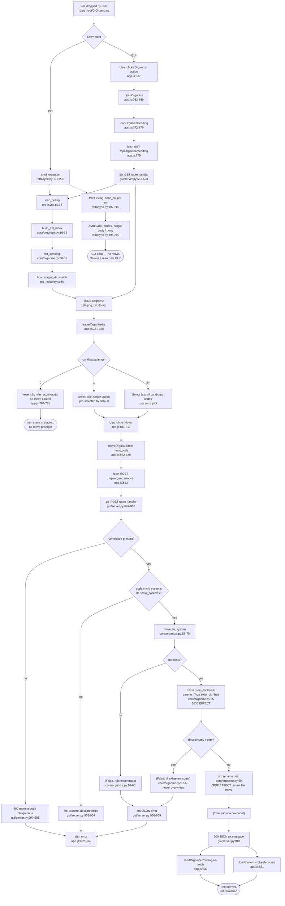

# Feature: ROM Organize/Staging

Classifies files dropped into a staging folder (`0-Organizar/`) into the correct system
subfolder by file extension, with GUI-driven manual disambiguation when an extension is
ambiguous between systems.

## Sources consulted

- `core/organize.py` — full read (71 lines): `build_ext_index`, `list_pending`, `move_to_system`
- `retrosync.py:170-210` (`cmd_organize`), `:370-420` (subparser + dispatch)
- `gui/server.py:545-575` (`GET /api/organize/pending`), `:885-915` (`POST /api/organize/move`)
- `gui/static/app.js:755-845` (organize modal)

## Concrete findings

**Config indexing (per request, no caching).** `build_ext_index(systems_cfg, heavy_systems_cfg)`
(`core/organize.py:16-35`) walks `cfg["systems"]` and `cfg["heavy_systems"]`, building
`ext -> [{code, nome, kind}]`. Codes present in both sections are deduplicated, with
`heavy_systems` overwriting the `leve` entry as `kind="pesado"`.

**Listing (read-only, shared by CLI and GUI).** `list_pending(roms_root, staging_dir_name, ext_index)`
(`:38-55`) lists `roms_root/<staging>/` (default `0-Organizar`, configurable via
`cfg["pc"]["organizar_dir"]`), skips dotfiles, looks up `ext_index[suffix]` per file. Directories
always get `candidates: []` — folder-per-game staging is explicitly out of scope (comment at line 50).

**GUI move flow.** `openOrganize()` → `loadOrganizePending()` → `GET /api/organize/pending`
(`gui/server.py:557-563`, rebuilds `ext_index` fresh, calls `list_pending`) → `renderOrganizeList()`
(`app.js:781-820`, zero candidates → plain text no move control; 1+ candidates → `<select>` with
one option per candidate, "Mover" button) → `moveOrganizeItem(name, code)` → `POST /api/organize/move`
(`gui/server.py:897-910`, validates presence and that `code` exists in config, else 400/404) →
`move_to_system(roms_root, staging, name, code)` (`core/organize.py:58-70`): checks `src` exists,
`mkdir(parents=True, exist_ok=True)` on destination system dir, checks destination doesn't already
exist (**never overwrites**), then `src.rename(dest)`.

**CLI path — list-only, never moves.** `cmd_organize` (`retrosync.py:177-203`) builds the same
`ext_index`, calls `list_pending`, prints `cand_str` per item (single code / "AMBIGUO: codes" /
"nenhum sistema reconhece"). Docstring and footer explicitly defer the move to the GUI because
disambiguation needs a UI.

**Side effects.** Only the filesystem move `src.rename(dest)` (`core/organize.py:69`) and the
possible `mkdir` of a new system folder (`:65`). No registry/index file touched anywhere —
`ext_index`/`pending` are computed fresh from `config.toml` + a live directory scan every request.

**Ambiguous extensions** (per module docstring, `core/organize.py:9-12`): `.iso` ambiguous among
PS2/GameCube/Wii/PSP; `.cue`/`.chd`/`.cdi`/`.gdi` ambiguous among PS/SDC/SS/PCECD/PS2.
System never auto-decides.

## Flowchart

## External dependencies

- Filesystem via `pathlib.Path` — `roms_root/<staging_dir>/` (source), `roms_root/<code>/` (dest)
- `config.toml`, via `load_config()` — `cfg["pc"]["roms_root"]`, `cfg["pc"]["organizar_dir"]`
  (default `"0-Organizar"`), `cfg["systems"]`, `cfg["heavy_systems"]` (extension mapping is
  entirely config-driven, no hardcoded extension list)
- Browser `fetch` API (client-side) for the two routes; stdlib `http.server` dispatch server-side
- No database, no network service, no third-party package on this feature's happy path

## Confidence note and known gaps

High confidence — every node traces to a directly-read line range; call chain is unambiguous with
no dynamic dispatch. `config.toml` itself and the exact extension→system table were not read
(only the docstring's examples) — doesn't affect the control-flow trace. `loadSystems()`
(triggered post-move at `app.js:831`) not read — noted only as a downstream GUI refresh, outside
this feature's scope.
