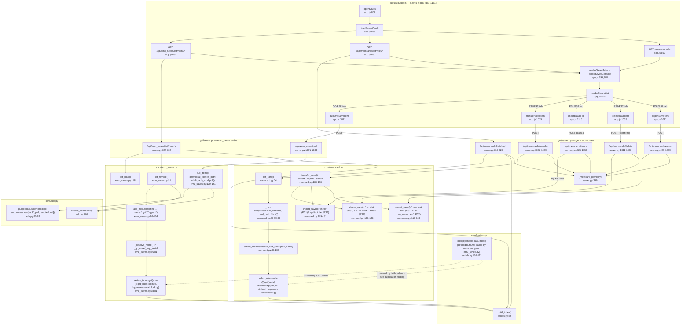

# Feature: Saves & Memory Card Management

Two distinct backend systems sharing one GUI modal ("💾 Saves"): (A) a PS1/PS2 memory-card editor
wrapping external `ps1vmc-tool`/`ps2vmc-tool` binaries, and (B) per-game save backup for
Dolphin(GameCube)/PPSSPP pulled from the phone via adb. Both resolve display names from a serial
number via a shared redump DAT index.

## Sources consulted

- `core/memcard.py` — full read (196 lines)
- `core/emu_saves.py` — full read (141 lines)
- `core/serials.py` — full read (113 lines)
- `core/adb.py` lines 34-83 (`run`/`shell`/`push`/`pull`)
- `gui/server.py:340-380` (`_memcard_path`), `:595-643` (list routes), `:985-1084` (write routes)
- `gui/static/app.js:852-1151` (Saves modal, all `/api/memcards/*` and `/api/emu_saves/*` calls)

## Concrete findings

**Shared entry point.** `openSaves()` (`app.js:852`) → `loadSavesCards()` (`:865`) fetches
`/api/memcards` (`server.py:603`) to enumerate configured PS1/PS2 slots from
`config.toml [memcards]`, then in parallel fetches `/api/memcards/list/<key>` per card and
`/api/emu_saves/list/GC` + `/api/emu_saves/list/PSP` (`app.js:878-889`). Tab switching is
client-side over already-fetched data.

**Path A — memcard editor.** `list_card()` (`memcard.py:74`) runs
`subprocess.run([binname, card_path, "-ls", "/"])` (`:57-59,80`, `binname` = `ps1vmc-tool`/
`ps2vmc-tool`). For each row, `serials_mod.normalize_slot_serial(raw_name)` (`:91,108`) derives a
serial looked up directly as `index.get(console,{}).get(serial)` (`:94,111`) — **this bypasses
`serials.lookup()` and re-implements its two-line body inline.**
- Export (`:117`): `-mcs <slot> <dest>` (PS1) / `-px <raw_name> <dest>` (PS2) → `export_dir`
  (default `~/Downloads`).
- Delete (`:131`): `-rm <slot>` (PS1); PS2 lists folder, removes each child, then `-rmdir`
  (`:137-146`, folders can't be removed non-empty).
- Import (`:149`): writes uploaded file to server-side temp path, `-in <file>` (PS1) or
  `-pu`/`-pi <file>` (PS2, by extension), always unlinks temp in `finally`.
- Transfer (`:184`): export→import→delete, ordered so a failed import never touches the source.

**Path B — emu_saves backup.** `list_remote()` (`emu_saves.py:91`) calls `ensure_connected` then
`adb shell "find <scan_root> -name '*.gci' ..."` (GC) or `-type d` (PSP) (`:98-104`). For each item,
`_resolve_name()` (`:76`) extracts a code/serial via regex (`_gc_code`/`_psp_serial`) and looks it
up directly as `serials_index.get(emu,{}).get(...)` (`:78-81`) — **again bypassing
`serials.lookup()`, duplicating its logic with different regexes than memcard.py.** `list_local()`
(`:118`) scans the mirrored local folder to flag `in_pc`.
- Pull (`:130`): computes `dest = local_root/rel_path`, creates parent dirs, re-confirms adb
  connection, calls `adb_mod.pull()` (`:138` → `adb.py:80-83`, itself redundantly re-creating
  parent dirs, then `subprocess.run(["adb","pull",...])`).

## Flowchart

## External dependencies

- `ps1vmc-tool` / `ps2vmc-tool` binaries (bucanero/ps2vmc-tool) on PATH — `core/memcard.py:_run` (`:57`)
- `adb` binary on PATH — `core/adb.py:run` (`:53`), used by `core/emu_saves.py` (`shell`, `pull`, `ensure_connected`)
- Android device connected via USB (adb) for `emu_saves` list/pull
- redump DAT files fetched over HTTP from `raw.githubusercontent.com/libretro/libretro-database`
  (`serials.py:38-43`), cached at `cache/serials_index.json` (`serials.py:36`)
- Local filesystem: `config.toml [memcards]` card image files (PS1 `.mcd`/`.gme`, PS2 `.ps2`/`.bin`);
  export dir (default `~/Downloads`); mirrored `Saves/Dolphin/GC/...` and `Saves/PPSSPP/SAVEDATA/...`

## Duplication flagged (Phase 2 input)

Both `core/memcard.py` (lines 91-94, 108-111) and `core/emu_saves.py` (lines 76-81) independently
derive a serial/code from a raw name and do `serials_index.get(<console>,{}).get(<key>)` inline,
rather than calling the module-level `serials.lookup(console, raw_slot_name, index)` helper
(`serials.py:107-113`) that already exists for exactly this purpose. **`serials.lookup()` appears
unused by both consumer modules** — dead/parallel code — and the two backends reimplement its
body slightly differently (memcard.py normalizes via `normalize_slot_serial` first; emu_saves.py
uses its own `_gc_code`/`_psp_serial` regexes first).

## Confidence note and known gaps

High confidence: all five scoped files/route ranges read in full, subprocess/adb argument lists
captured verbatim. Gaps: `core/adb.py` not read in full (only relevant function signatures);
`gui/static/index.html` modal markup not read; `config.toml` itself not read. Error/fallback
branches (404 unknown card/emu, 400 empty item, 502 tool/adb failure, `android_ok=false`) noted
but not elaborated per scope instructions.
