# Feature: Support Utilities (Sanitize, Settings, Global Search)

Three small, cross-cutting features: (A) filename sanitization, (B) GUI settings editor for
`config.toml` paths, (C) global cross-system library search.

## Sources consulted

- `core/sanitize.py` — full file (59 lines)
- `retrosync.py:26,33-37,270-313,385-393,419-420`
- `gui/server.py:1-60,150-195,400-463,505-531,655-679,700-770,920-975`
- `gui/static/app.js:1-90,350-424`
- Repo-wide grep for `sanitize_name|sanitize_mod|needs_sanitizing|scan_and_rename|core.sanitize`

## Concrete findings

**(A) CLI `sanitize-names --apply`.** `retrosync.py:390-392` registers the subcommand
(`target` in `capas|roms|all`, `--apply`), dispatches to `cmd_sanitize_names` (`:278-311`), which
loads config and calls `sanitize_mod.scan_and_rename(root, apply=args.apply)` (`:294`) per root.
`scan_and_rename` (`core/sanitize.py:36-59`) globs `root.rglob("*")`, skips names that don't
`needs_sanitizing` (`:32-33`, checks for `&/:*`), computes `new_name = sanitize_name(path.name)`
(`:26-29`: `&`→`and`, `/`→`_`, `:`→`-`, `*`→``). If the destination already exists, records
`"conflito"` and **never touches the file** — the hard side-effect guard. Otherwise, `--apply`
does `path.rename(new_path)` (`"renomeado"`); dry-run records `"seria_renomeado"`.

**(B) GUI settings save.** `openSettings()` (`app.js:359-378`) fetches `GET /api/settings`
(`gui/server.py:522-524`, returns `{"pc": cfg.pc, "android": cfg.android}` from a fresh
`load_config()`). `saveSettings()` (`app.js:384-408`) collects inputs, `POST /api/settings`.
`write_settings_paths(body)` (`gui/server.py:167-186`) re-reads `config.toml` as raw text,
tracks the current `[section]` header while scanning, and for lines matching
`^(\s*)([A-Za-z0-9_]+)(\s*=\s*)"([^"]*)"(.*?)(\r?\n?)$` whose key is in `updates[section]`,
rewrites only the quoted value in place — preserving indentation, comments, and untouched
sections. Writes the whole file back via `CONFIG_PATH.write_text(...)`.

**(C) Global cross-system search.** Debounced (300ms) input → `runGlobalSearch()`
(`app.js:27-53`) → `GET /api/search_library?q=...&code=...` (min length 2, enforced both sides).
`gui/server.py:425-463`: normalizes query (NFKD + ASCII-fold + lowercase), loops
`cfg["systems"]` (skipping `COVERS_EXCLUDED`, optional `code_filter`), scans
`capas_root/<capas>/Named_Boxarts` for `.png`/`.jpg`. For arcade systems, also resolves
`display_name` via `covers_mod.arcade_display_name` and matches against `label + " " +
display_name`. Read-only, capped at 100 results, sorted. `goToSearchResult()` (`app.js:55-67`)
switches tab, scrolls, flashes highlight — no network side effects.

## Duplication evidence — every call site reusing `sanitize_name`

Repo-wide grep found exactly these usages, no others:

1. `retrosync.py:26` — import
2. `retrosync.py:294` — `sanitize_mod.scan_and_rename(root, apply=...)`, the **only** caller of
   the batch/conflict-safe scan function
3. `gui/server.py:38` — import
4. **`gui/server.py:735`** — `sanitize_mod.sanitize_name(new_label_raw)` inside
   `POST /api/cover/rename` — bypasses `scan_and_rename`'s conflict logic, uses its own ad-hoc
   `dest.exists()` check at `gui/server.py:749` instead
5. **`gui/server.py:955`** — same pattern inside `POST /api/heavy/rename`, conflict handling
   delegated to `rom_rename_mod.rename_with_cascade`'s own status codes instead

Both GUI call sites use only the low-level `sanitize_name()`, never `needs_sanitizing()` — each
handler re-implements its own conflict guard rather than reusing `scan_and_rename`'s. No other
file (`rom_rename.py`, `organize.py`, `heavy_roms.py`) contains sanitize-related calls.

## Flowchart

```mermaid
flowchart TD
    subgraph A["(A) CLI sanitize-names --apply"]
        A1["argparse: sanitize-names subcommand<br/>retrosync.py:390-392"]
        A2["dispatch to cmd_sanitize_names<br/>retrosync.py:419-420"]
        A3["cmd_sanitize_names<br/>retrosync.py:278-311"]
        A4["load_config reads config.toml<br/>retrosync.py:33-37"]
        A5["resolve capas_root + roms_root<br/>retrosync.py:283-284"]
        A6["scan_and_rename per root<br/>retrosync.py:294 -> core/sanitize.py:36-59"]
        A7["root.rglob walk + needs_sanitizing filter<br/>core/sanitize.py:42-46"]
        A8["sanitize_name replaces & / : *<br/>core/sanitize.py:26-29,47"]
        A9{"new_path.exists?<br/>core/sanitize.py:51"}
        A10["status=conflito, file untouched<br/>core/sanitize.py:52"]
        A11{"apply flag set?<br/>core/sanitize.py:54"}
        A12["SIDE EFFECT: path.rename(new_path)<br/>core/sanitize.py:55"]
        A13["status=seria_renomeado, dry-run only<br/>core/sanitize.py:58"]
        A14["print per-file results + totals<br/>retrosync.py:298-311"]
        A1 --> A2 --> A3 --> A4 --> A5 --> A6 --> A7 --> A8 --> A9
        A9 -- yes --> A10 --> A14
        A9 -- no --> A11
        A11 -- yes --> A12 --> A14
        A11 -- no --> A13 --> A14
    end

    subgraph B["(B) GUI settings save"]
        B1["openSettings click<br/>app.js:359,410"]
        B2["GET /api/settings<br/>app.js:361 -> gui/server.py:522-524"]
        B3["return cfg.pc + cfg.android<br/>gui/server.py:524"]
        B4["render form inputs<br/>app.js:363-377"]
        B5["saveSettings click<br/>app.js:384,412"]
        B6["collect input values into updates dict<br/>app.js:385-391"]
        B7["POST /api/settings JSON body<br/>app.js:394-398"]
        B8["do_POST dispatch<br/>gui/server.py:673"]
        B9["write_settings_paths(body)<br/>gui/server.py:167-186,676"]
        B10["read config.toml as text lines<br/>gui/server.py:172-173"]
        B11["track current section header<br/>gui/server.py:174-179"]
        B12{"key line matches regex<br/>and is in updates[section]?<br/>gui/server.py:181-182"}
        B13["SIDE EFFECT: rewrite quoted value<br/>in-place, preserve rest of line<br/>gui/server.py:183-185"]
        B14["SIDE EFFECT: CONFIG_PATH.write_text<br/>full file rewritten, comments preserved<br/>gui/server.py:186"]
        B15["return ok:true -> loadSystems + close modal<br/>gui/server.py:679, app.js:399-402"]
        B16["return error:msg, HTTP 500<br/>gui/server.py:677-678"]
        B1 --> B2 --> B3 --> B4 --> B5 --> B6 --> B7 --> B8 --> B9 --> B10 --> B11 --> B12
        B12 -- yes --> B13 --> B14
        B12 -- no --> B14
        B14 -->|success| B15
        B9 -.exception.-> B16
    end

    subgraph C["(C) Global cross-system search"]
        C1["input/change on search box<br/>app.js:69-73"]
        C2["runGlobalSearch, debounced 300ms<br/>app.js:27-53"]
        C3{"query length &lt; 2?<br/>app.js:31"}
        C4["hide results, no fetch<br/>app.js:32-34"]
        C5["GET /api/search_library?q=&code=<br/>app.js:36 -> gui/server.py:425"]
        C6["normalize query NFKD/ascii/lower<br/>gui/server.py:437"]
        C7["loop cfg.systems, skip excluded/filtered<br/>gui/server.py:438-445"]
        C8["scan Named_Boxarts dir for png/jpg<br/>gui/server.py:446-451"]
        C9["build haystack: label + arcade display_name<br/>gui/server.py:453-459"]
        C10{"q_norm in haystack_norm?<br/>gui/server.py:460"}
        C11["append match code/label/file/display_name<br/>gui/server.py:461"]
        C12["sort + cap at 100, READ-ONLY<br/>gui/server.py:462-463"]
        C13["render result rows, click handler<br/>app.js:39-52"]
        C14["goToSearchResult: selectSystem + scroll<br/>+ highlight card, no side effect<br/>app.js:55-67"]
        C1 --> C2 --> C3
        C3 -- yes --> C4
        C3 -- no --> C5 --> C6 --> C7 --> C8 --> C9 --> C10
        C10 -- yes --> C11 --> C12
        C10 -- no --> C12
        C12 --> C13 --> C14
    end

    subgraph EXT["External dependency: sanitize_name reuse"]
        S1["core/sanitize.py:26-29<br/>sanitize_name(name)"]
        S2["POST /api/cover/rename handler<br/>gui/server.py:720-750<br/>call at line 735"]
        S3["POST /api/heavy/rename handler<br/>gui/server.py:943-974<br/>call at line 955"]
        S4["SIDE EFFECT: cover file rename<br/>+ rom_rename_mod cascade<br/>gui/server.py:752,758-760"]
        S5["SIDE EFFECT: ROM/save/state cascade rename<br/>gui/server.py:962-964"]
        A8 -. same function, different entry point .-> S1
        S1 --> S2 --> S4
        S1 --> S3 --> S5
    end
```

## External dependencies — every call site reusing sanitize_name

1. `retrosync.py:26` — import
2. `retrosync.py:294` — `scan_and_rename()`, only caller of the batch/conflict-safe path
3. `gui/server.py:38` — import
4. `gui/server.py:735` — inline `sanitize_name()` in cover-rename, own ad-hoc conflict check
5. `gui/server.py:955` — inline `sanitize_name()` in heavy-rename, conflict handled by cascade

No other file in the repo contains sanitize-related calls — `core/rom_rename.py` performs cascade
mechanics only and trusts the caller to have already sanitized the label.

## Confidence note and known gaps

High confidence: all three happy paths and requested line ranges read directly; sanitize_name
call-site inventory exhaustive per repo-wide grep (3 call sites total).

- `core/rom_rename.py`'s `rename_with_cascade` internals not read in full — only confirmed it
  holds no sanitization logic.
- `covers_mod.arcade_display_name` / `_arcade_romname_dat` treated as opaque helpers for search.
- `write_settings_paths`'s regex only matches double-quoted string values — numeric/boolean/array
  TOML values would silently fail to update, but none observed in the sections read; not
  independently confirmed against the actual `config.toml`.
