# PyRetro — Unified Architecture Proposal

Ten concrete consolidations, one per duplicated concern from
[`02-duplication-report.md`](02-duplication-report.md) that is not legitimate specialization.
Each names the new component, its single entry point, and what every old call site becomes.
Legitimately-divergent code (adb-based vs local-filesystem overwrite checks, PS1/PS2 tool output
parsing, the three high-level "enumerate PC vs remote" functions) is left untouched — unifying
those would trade correct specialization for a false abstraction.

## 1. `core/png_fetch.py` — `finalize_as_png(tmp_path, dest_path) -> bool`

**Replaces:** the "write bytes → `convert` → verify size → clean up" tail duplicated in
`core/covers.py:384-390,423-429`, `core/launchbox.py:194-204`, `core/screenscraper.py:160-171`,
and `gui/server.py:142-164,833-846`.

**Design:** one function, called after each source's own (legitimately different) fetch step:
```python
def finalize_as_png(tmp_path: Path, dest_path: Path) -> bool:
    r = subprocess.run(["convert", str(tmp_path), str(dest_path)], capture_output=True)
    ok = r.returncode == 0 and dest_path.exists() and dest_path.stat().st_size > 1000
    tmp_path.unlink(missing_ok=True)
    return ok
```
- `core/covers.py:384-390` (`convert_jpg_to_png`) → fetch stays, tail becomes `finalize_as_png(...)`
- `core/covers.py:423-429` (`validate_png_content`, in-place repair branch) → same
- `core/launchbox.py:202` → same
- `core/screenscraper.py:167-169` → same
- `gui/server.py:142-164` (`download_selected_cover`) → same; also stop reaching into
  `covers_mod._download_via_api`/`covers_mod.RateLimited` — export those two names from
  `core/covers.py`'s public surface instead of leaving the GUI to import underscore-prefixed
  internals
- `gui/server.py:833-846` (upload handler) → same

**Loss of capability:** none — behavior is identical, only the repeated tail is extracted.

## 2. `core/covers.py` — `_fetch_cached_bytes(cache_path, url) -> None`

**Replaces:** the identical "download to cache file if missing" block in `load_tree`
(`core/covers.py:84-90`) and `load_romname_dat` (`:137-142`).

```python
def _fetch_cached_bytes(cache_path: Path, url: str) -> None:
    if cache_path.exists():
        return
    cache_path.parent.mkdir(parents=True, exist_ok=True)
    req = urllib.request.Request(url, headers={"User-Agent": "PyRetro"})
    with urllib.request.urlopen(req, timeout=30) as resp:
        cache_path.write_bytes(resp.read())
```
Both `load_tree` and `load_romname_dat` call this, then read from `cache_path` as before.
**Loss of capability:** none.

## 3. `core/adb.py` — `find(remote_dir, predicate="") -> list[str]`

**Replaces:** the three independent "`adb shell find`, split lines, strip prefix" implementations.

```python
def find(remote_dir: str, predicate: str = "", serial: str | None = None) -> list[str]:
    cmd = f"find {shquote(remote_dir)} {predicate}".strip()
    r = shell(cmd, serial=serial)
    return [line for line in r.stdout.splitlines() if line.strip()]
```
- `core/heavy_roms.py:90-109` (`list_remote_names`) → calls `adb_mod.find(dir, "-mindepth 1 -maxdepth 1")`, keeps its own name-stripping/set-building
- `core/emu_saves.py:98-104` (`list_remote`) → calls `adb_mod.find(dir, f"-name {shquote(glob)}")` or `-type d`, keeps its own dict-building
- `core/sync.py:47-73` (`_remote_mtimes`) → keeps its own `stat -c '%Y %n'` variant (different
  output shape, needs mtimes not just paths) but now goes through `adb_mod.shquote()` for the
  directory argument instead of hand-rolled `'...'` quoting — **this also fixes the one place in
  the codebase not following `adb.py`'s own documented quoting convention**

**Loss of capability:** none — each caller keeps its own post-processing; only the shell-and-split
step is shared.

## 4. `gui/server.py` — `_start_job(prefix, target, *args) -> str` + `run_job(fn)` wrapper

**Replaces:** the tripled job-registration boilerplate and `emit()`/try-except-finally wrapper.

```python
def _start_job(prefix: str, target, *args) -> str:
    job_id = f"{prefix}{threading.get_ident()}-{id(object())}"
    q = queue.Queue()
    with _jobs_lock:
        _jobs[job_id] = q
    threading.Thread(target=target, args=(q, *args), daemon=True).start()
    return job_id

def run_job(q: queue.Queue, body):
    def emit(event: dict) -> None:
        q.put(event)
    try:
        body(emit)
    except Exception as e:
        emit({"type": "error", "message": str(e)})
    finally:
        emit({"type": "job_done"})
```
- `gui/server.py:888-895` (`POST /api/fetch/<code>`) → `job_id = _start_job("fetch-", run_fetch_job, code, apply, fallback)`
- `gui/server.py:919-926` (`POST /api/heavy/send`) → `job_id = _start_job("heavy-send-", run_heavy_send_job, code, name, overwrite)`
- `gui/server.py:934-941` (`POST /api/heavy/download`) → `job_id = _start_job("heavy-dl-", run_heavy_download_job, code, name)`
- `run_fetch_job`/`run_heavy_send_job`/`run_heavy_download_job` each become a small `body(emit)`
  closure passed to `run_job` — only the 5-10 domain-specific lines remain per job type
- `GET /api/fetch/stream` (`:644-663`) — **unchanged**, it was already correctly generic

**Loss of capability:** none. Side benefit: job-id prefixes become consistent and self-documenting
instead of ad-hoc (`""`, `"heavy-"`, `"heavydl-"`).

## 5. `gui/server.py` — `_resolve_roots(cfg) -> (Path, Path, Path)`

**Replaces:** the identical 3-line `roms_root`/`saves_dir`/`states_dir` resolution repeated 4
times.

```python
def _resolve_roots(cfg) -> tuple[Path, Path, Path]:
    pc = cfg["pc"]
    return (Path(pc["roms_root"]).expanduser(),
            Path(pc["saves_root"]).expanduser(),
            Path(pc["states_root"]).expanduser())
```
- `gui/server.py:754-757` (cover-rename), `:787-790` (cover-delete), `:959-961` (heavy-rename),
  `:987-989` (heavy-delete) → each becomes `roms_root, saves_dir, states_dir = _resolve_roots(cfg)`

**Loss of capability:** none.

## 6. `core/sanitize.py` — `sanitize_or_conflict(name, exists_check) -> tuple[str, bool]`

**Replaces:** the three different conflict-detection mechanisms sitting downstream of
`sanitize_name()` calls (Support Utilities' own `scan_and_rename`, Cover Gallery Curation's
ad-hoc `dest.exists()`, Heavy ROM Management's cascade-status mapping).

```python
def sanitize_or_conflict(name: str, exists_check) -> tuple[str, bool]:
    new_name = sanitize_name(name)
    return new_name, exists_check(new_name)
```
- `gui/server.py:735,748-750` (cover-rename) → `new_label, conflict = sanitize_mod.sanitize_or_conflict(new_label_raw, lambda n: (capas_dir/n).exists())`; on `conflict` return 409 as before
- `gui/server.py:955` (heavy-rename) → sanitize step becomes `new_label, _ = sanitize_mod.sanitize_or_conflict(new_label_raw, lambda n: False)` **if** the cascade's own conflict detection should remain authoritative (it inspects the ROM/save/state cascade, not just one path) — in this case only the *sanitize* call is unified, the conflict source stays intentionally different because it's checking a different thing (a whole cascade, not one file). This is not full unification — see note below.
- `core/sanitize.py:51-53` (`scan_and_rename`'s own loop) → could call the same helper per-file,
  but its loop already needs the tuple form; low priority to touch since it's the one caller that
  was already correct.

**Loss of capability:** none in the cover-rename case (still 409s on collision, same as before).
**Honest limitation:** heavy-rename's conflict source is the cascade engine's own multi-file
status, not a single-path check — full unification of *that* conflict mechanism with the other
two isn't possible without changing what "conflict" means for a cascading rename. Only the
`sanitize_name()` call itself is unified there; the report's "three conflict mechanisms" finding
is reduced to "two are actually the same concept (single-path collision), one is structurally
different by necessity (cascade collision)" — this matches the report's own (d) verdict.

## 7. `gui/server.py` — registry-status dispatch table replaces flag/unflag/duplicate/unduplicate

**Replaces:** four near-identical POST handlers (`unflag`/`unduplicate` were byte-for-byte
identical).

```python
_REGISTRY_STATUS = {"flag": "flagged_wrong", "duplicate": "duplicate"}

def _set_status(self, action, code, label):
    reg = load_registry()
    reg.setdefault(code, {})[label] = {"status": _REGISTRY_STATUS[action]}
    save_registry(reg)

def _clear_status(self, code, label):
    reg = load_registry()
    reg.get(code, {}).pop(label, None)
    save_registry(reg)
```
- `POST /api/cover/flag` (`:682-687`) → `self._set_status("flag", code, label)`
- `POST /api/cover/duplicate` (`:703-708`) → `self._set_status("duplicate", code, label)`
- `POST /api/cover/unflag` (`:689-700`) and `POST /api/cover/unduplicate` (`:710-718`) → both call
  the single `self._clear_status(code, label)`

**Loss of capability:** none — this is a pure line-count reduction (38 → ~15 lines) with a
2-entry dict, not a registry/factory abstraction (per the anti-pattern guard, a dict this small
is the switch-statement-equivalent, not new machinery).

## 8. `core/rom_rename.py` — `_find_single_match()` shared by rename and delete; fix `_rename_flat_matches`

**Replaces:** B1 (duplicate single-item match block) and B2 (`_rename_flat_matches` reimplements
`find_flat_matches` instead of calling it).

```python
def _find_single_match(roms_dir: Path, label: str, exts_lower: set[str]) -> list[Path]:
    # existing stem+ext / directory-fallback logic from _rename_rom:101-120 / _delete_rom:182-197
    ...
```
- `_rename_rom` (`:101-120`) → `matches = _find_single_match(roms_dir, old_label, exts_lower)`, keeps its own disc-group check *before* calling this (rename-only, by design)
- `_delete_rom` (`:182-197`) → `matches = _find_single_match(roms_dir, label, exts_lower)`, no disc-group step (delete-only, by design)
- `_rename_flat_matches` (`:148-153`) → replace its inline re-filter with
  `matches = find_flat_matches(folder, old_label)`, matching the pattern `delete_flat_matches`
  already uses correctly

**Loss of capability:** none — both are behavior-preserving extractions; the disc-group
distinction (rename groups multi-disc titles, delete never does — a deliberate safety rule per
the module docstring) is preserved because it stays *outside* the shared helper, not inside it.

## 9. `core/serials.py` — widen `lookup()` to accept a pre-resolved key; call it from both consumers

**Replaces:** Finding 1/F2 — the unused `lookup()` helper and its two independent reimplementations.

```python
def lookup(console: str, index: dict, *, raw: str | None = None, key: str | None = None):
    resolved_key = key if key is not None else normalize_slot_serial(raw)
    return index.get(console, {}).get(resolved_key)
```
- `core/memcard.py:91,94` (PS1) → `name = serials_mod.lookup("PS1", serials_index, raw=raw_name)` (or `key=prod` when the `prod` fallback applies — preserves the one real behavioral difference the within-feature agent found)
- `core/memcard.py:108,111` (PS2) → `name = serials_mod.lookup("PS2", serials_index, raw=raw_name)` — exact drop-in, no `prod` fallback needed here
- `core/emu_saves.py:76-81` (`_resolve_name`) → keeps its own `_gc_code`/`_psp_serial` regex
  extraction (genuinely different raw-name formats), then calls
  `serials_mod.lookup(emu, serials_index, key=code)` instead of the inline `.get().get()`

**Loss of capability:** none — the widened signature is a superset of the old one; every existing
caller's exact behavior (including memcard.py's PS1 `prod` fallback) is preserved via the new
`key=` parameter.

## 10. Two small local fixes (no new shared component needed)

- **`core/organize.py` `build_ext_index`** (Finding E1): replace the two near-identical loops with
  one loop over `[(systems_cfg, "capas", "leve"), (heavy_systems_cfg, "nome", "pesado")]`.
- **`gui/server.py` `search_library`** (Finding G1): extract the repeated
  `unicodedata.normalize("NFKD", s).encode("ascii","ignore").decode().lower()` chain into a local
  `_fold(s)` closure inside the handler, called for both `q` and each `haystack`.
- **`core/memcard.py` `import_save`** (Finding F1): compute `(valid_exts, run_args)` per console
  up front, wrap a single `_run()` call in one `try/except MemcardError` instead of duplicating
  the "sem espaço" message in both branches.
- **`gui/server.py` memcard routes** (Finding F3): extract
  `_resolve_card_and_item(body) -> (path, console, item) | error_response` used by `export`,
  `delete`, and (partially) `transfer`.

These four are small enough that no dedicated section/diagram node is warranted — each is a
same-file, same-function refactor with zero cross-feature surface.

## Explicitly not unified (legitimate specialization, left as-is)

- **Overwrite guards** (Finding 4): the one adb-based remote check (`heavy_roms.py:125-131`)
  stays separate from the five local `Path.exists()` checks — different transport, can't share
  code. The five local ones are individually too small (one-liners) to warrant a shared helper on
  their own merit once Finding 3/4/5's larger patterns are addressed; flagged in the duplication
  report as an *inconsistency* (which paths support `overwrite=True`) rather than a code-duplication
  fix, since resolving it would mean changing behavior (adding overwrite support where absent),
  not just refactoring.
- **"Enumerate PC vs remote" high-level functions** (Finding 2's callers): `list_local`/
  `list_drive_items`/`list_remote_names` (heavy_roms), `_local_mtimes`/`_remote_mtimes` (sync),
  `list_local`/`list_remote` (emu_saves) each return different shapes for different purposes —
  only their shared low-level primitive (proposal #3 above) is unified, not the functions
  themselves.
- **`memcard.py` PS1 vs PS2 row-parsing**: different tool output formats (fixed-width regex vs.
  pipe-delimited columns) — correctly separate.
- **`sync_capas`'s push/pull loops** (Finding C1): structurally similar but carry an intentional
  mtime-source asymmetry tied to the module's conflict-detection correctness guarantee — left
  unmerged in this proposal; a future pass could parameterize it but only with explicit care to
  preserve `mtime_android`'s two different derivations for push vs. pull.

## Combined proposed architecture

```mermaid
flowchart TD
    subgraph NewShared["New shared components"]
        PNGF["core/png_fetch.py<br/>finalize_as_png(tmp, dest)"]
        CACHEDL["core/covers.py<br/>_fetch_cached_bytes(path, url)"]
        ADBFIND["core/adb.py<br/>find(dir, predicate)"]
        JOBRUN["gui/server.py<br/>_start_job() + run_job()"]
        ROOTS["gui/server.py<br/>_resolve_roots(cfg)"]
        SANOC["core/sanitize.py<br/>sanitize_or_conflict(name, check)"]
        REGDISPATCH["gui/server.py<br/>_set_status()/_clear_status()"]
        FINDMATCH["core/rom_rename.py<br/>_find_single_match()"]
        LOOKUP["core/serials.py<br/>lookup(console, index, raw=|key=)"]
    end

    subgraph CAP["Cover Acquisition Pipeline"]
        COVERS["core/covers.py<br/>process_system"]
        LB["core/launchbox.py"]
        SS["core/screenscraper.py"]
    end
    subgraph CGC["Cover Gallery Curation"]
        RENAME["POST /api/cover/rename"]
        DELETE["POST /api/cover/delete"]
        UPLOAD["POST /api/cover/upload"]
        SELECT["POST /api/cover/select"]
        FLAGS["flag/unflag/duplicate/unduplicate"]
    end
    subgraph CPAS["Cover PC-Android Sync"]
        SYNC["core/sync.py<br/>_remote_mtimes"]
    end
    subgraph HRM["Heavy ROM Management"]
        SEND["send_to_phone / run_heavy_send_job"]
        DL["download_from_drive / run_heavy_download_job"]
        HRENAME["POST /api/heavy/rename"]
        HDELETE["POST /api/heavy/delete"]
        LISTREMOTE["list_remote_names"]
    end
    subgraph ROS["ROM Organize/Staging"]
        ORG["build_ext_index"]
    end
    subgraph SMC["Saves & Memory Card"]
        MEMCARD["core/memcard.py"]
        EMUSAVE["core/emu_saves.py"]
    end
    subgraph FETCHJOB["Cover fetch job runner"]
        FJ["run_fetch_job"]
    end

    COVERS --> PNGF
    LB --> PNGF
    SS --> PNGF
    SELECT --> PNGF
    UPLOAD --> PNGF
    COVERS --> CACHEDL

    SYNC --> ADBFIND
    LISTREMOTE --> ADBFIND
    EMUSAVE --> ADBFIND

    FJ --> JOBRUN
    SEND --> JOBRUN
    DL --> JOBRUN

    RENAME --> ROOTS
    DELETE --> ROOTS
    HRENAME --> ROOTS
    HDELETE --> ROOTS

    RENAME --> SANOC
    HRENAME --> SANOC

    FLAGS --> REGDISPATCH

    RENAME --> FINDMATCH
    DELETE --> FINDMATCH

    MEMCARD --> LOOKUP
    EMUSAVE --> LOOKUP
```



Every node inside `NewShared` is a small, single-purpose function or closure — no new classes,
registries, factories, or feature flags were introduced, per the anti-pattern guard. Each
existing call site changes from N duplicated lines to a 1-3 line call into the shared function;
none of them lose behavior or gain a speculative parameter they don't currently need.
